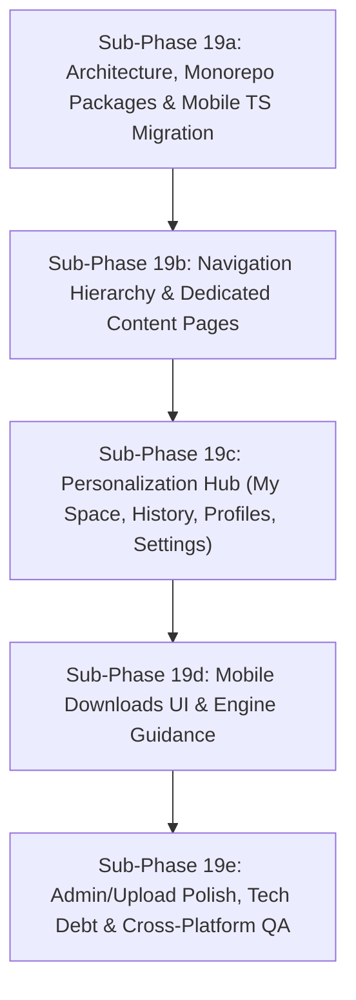

# Phase 19 Planning Document — UI Architecture & Product Experience Upgrade

Following the explicit requirements in `docs/PROJECT_STATUS.md` and `docs/AI_COLLABORATION_RULES.md`, this document serves as the **comprehensive architecture audit, product roadmap, sub-phase breakdown, and verification plan for Phase 19**.

Per project rules, **no implementation will begin until this plan is explicitly approved by the project owner**.

---

## Executive Summary & Sub-Phase Strategy

The current UI (completed in Phase 18) established the core visual theme and two-step auth integration across Web, Mobile, and Desktop. However, functionality is currently jammed into an overloaded `Catalog` page with weak navigation. 

Phase 19 transforms StreamFlix from a single-page catalog demo into a **production-grade multi-platform streaming app** with dedicated navigation hubs (Home, Movies, Series, Categories, Search, My Space, Watchlist, Continue Watching, History, Profile Management, Settings, Downloads), shared monorepo packages, full TypeScript consistency on mobile, and a clear sub-phase execution path.

Given the scope, **Phase 19 is split into 5 structured sub-phases (19a – 19e)**. Each sub-phase completes with a cross-platform QA check before moving to the next.

---

## 1. Existing Architecture & System Audits

### 1.1 Backend Capabilities Audit
- **Auth & Profiles**: `POST /auth/login` (Account token) + `POST /profiles/{id}/select` (Profile token). Fully supports profile-scoped interactions. Profile CRUD (`GET/POST/PUT/DELETE /profiles`) exists in backend (`app/api/profile.py`), but Mobile currently lacks UI to create or edit profiles.
- **Watch History (`watch_history` table)**:
  - *Schema & Behavior*: Keyed on `(profile_id, content_id)` with `ON CONFLICT DO UPDATE`. Updates `progress_seconds` and `last_watched_at`.
  - *Audit Finding*: Current backend tracks **latest progress per content item per profile** (acting as Continue Watching). It does **NOT** log every separate watch session event.
  - *Planning Recommendation*: The dedicated **History** page in Phase 19 will render the full list of watched items sorted by `last_watched_at`. If true multi-session timestamp logs are desired in the future, a schema migration to a separate `watch_logs` table can be deferred to a future phase.
- **Content & Series Endpoints**:
  - `GET /content/trending` returns `{ movies, series, overall }` (`DiscoverItem[]`).
  - `GET /content/latest` returns `{ movies, series, overall }` (`DiscoverItem[]`).
  - `GET /content/{id}/details` and `GET /series/{id}/details` bundle ratings, watchlist status, progress, and episode/similar data in 1 call.
- **Admin & Storage**: `GET /admin/users`, `PATCH /admin/users/{id}/role`, `GET /admin/storage`. Storage endpoint runs a synchronous `os.walk`, which will be wrapped in an async executor (`anyio.to_thread.run_sync`).

### 1.2 Web Architecture Review (`apps/web`)
- **Stack**: React + Vite + `HashRouter` + Vanilla CSS tokens.
- **Routing State**: Plain router setup without nested layout wrappers. `Catalog.jsx` acts as a monolithic catch-all page.
- **Needed Changes**: Introduce a root layout with a fixed, collapsed-capable **Sidebar / Header Navigation Bar**. Route decomposition into dedicated page components under `src/pages/`.

### 1.3 Mobile Architecture Review (`apps/mobile`)
- **Stack**: React Native + React Navigation (Native Stack).
- **Navigation State**: `App.tsx` conditionally swaps Stack navigators based on auth state (`Login` -> `ProfilePicker` -> `MainStack`).
- **Needed Changes**: Implement a modern **Bottom Tab Navigator** (`Home`, `Movies`, `Series`, `Search`, `Downloads`, `My Space`) inside `MainStack`.

### 1.4 Desktop Architecture Review (`apps/desktop`)
- **Stack**: Electron shell wrapping the Vite web build (`apps/web/dist`).
- **Current State**: `main.js` configures window bounds (`minWidth: 1024`, `minHeight: 700`), dark background `#0D1117`, and `autoHideMenuBar`.
- **Needed Changes**: Inherits all Web Phase 19 layout improvements automatically. Add native menu keyboard shortcuts and window control handling.

### 1.5 Shared Package Audit (`packages/`)
- Currently `packages/types`, `packages/api-client`, and `packages/ui` are empty folders.
- **Action**: Extract shared interfaces to `packages/types`, HTTP service methods (`auth`, `catalog`, `interactions`, `upload`, `admin`, `resolveMediaUrl`) to `packages/api-client`, and design tokens to `packages/ui`.

---

## 2. Codebase Organization & Mobile TS Migration

### 2.1 Mobile Codebase Audit — JS to TS Migration
The React Native app has mixed file extensions (`api/auth.js`, `api/client.js`, `api/profiles.js` vs `screens/*.tsx`).
- **Standard**: Strictly **TypeScript (`.ts` / `.tsx`)**.
- **Migration Plan (Sub-phase 19a)**:
  1. Convert `apps/mobile/src/api/*.js` -> `apps/mobile/src/api/*.ts`.
  2. Add strict interface typing for network request params and responses.
  3. Resolve all implicit `any` types across Mobile context and screen files.

### 2.2 Folder & Naming Consistency
- **Component Naming**: PascalCase for all React components (`PosterCard.tsx`, `HeroBanner.tsx`).
- **Module Naming**: camelCase for API services and utilities (`apiClient.ts`, `mediaUrl.ts`).
- **Folder Structure Standardization**:
  ```
  src/
  ├── api/          (or imported from @streamflix/api-client)
  ├── components/   (reusable UI components: cards, banners, lists, Modals)
  ├── context/      (AuthContext, ProfileContext, ThemeContext)
  ├── hooks/        (custom React hooks: useDebounce, useWatchlist, useDownload)
  ├── pages/        (or screens/ on mobile)
  └── styles/       (CSS tokens and stylesheets)
  ```

---

## 3. Product Feature Map & Dedicated Screen Plan

The overloaded `Catalog` page is being decomposed into dedicated, specialized product screens across Web and Mobile:

| Page / Screen | Web Route | Mobile Screen | Key Purpose & Features | Priority |
|---|---|---|---|---|
| **Home** | `/#/` | `HomeScreen` | Hero Banner, Continue Watching, Trending Row, Top-Rated Row, Recently Added | High (Phase 19b) |
| **Movies** | `/#/movies` | `MoviesScreen` | Dedicated Movies grid, filter by category, sort by popularity/date | High (Phase 19b) |
| **Series** | `/#/series` | `SeriesScreen` | Dedicated Series grid, filter by category, season/episode count badges | High (Phase 19b) |
| **Categories** | `/#/categories` | `CategoriesScreen` | Visual category cards grid, deep-dive category content view | High (Phase 19b) |
| **Search** | `/#/search` | `SearchScreen` | Full-screen search with instant debounced autocomplete, recent searches | High (Phase 19b) |
| **My Space** | `/#/myspace` | `MySpaceScreen` | Personal user hub: profile avatar, quick stats, watchlist preview, history link | High (Phase 19c) |
| **Watchlist** | `/#/watchlist` | `WatchlistScreen` | Full grid of saved movies & series, remove/manage controls | High (Phase 19c) |
| **Continue Watching** | `/#/continue-watching` | `ContinueWatchingScreen` | Full-screen progress cards with exact resume percentages, clear/remove actions | High (Phase 19c) |
| **History** | `/#/history` | `HistoryScreen` | Chronological list of watched items with timestamps and replay triggers | High (Phase 19c) |
| **Profile Management** | `/#/profiles/manage` | `ProfileManageScreen` | Web & Mobile UI to create, edit, delete profiles and select avatar illustrations | High (Phase 19c) |
| **Settings** | `/#/settings` | `SettingsScreen` | App preferences, video playback defaults, LAN backend IP config (Mobile) | Medium (Phase 19c) |
| **Downloads** | *N/A (Mobile Only)* | `DownloadsScreen` | Offline downloaded items list, storage usage bar, delete/manage video files | High (Phase 19d) |
| **Upload Wizard** | `/#/upload` | `UploadScreen` | Redesigned tabbed wizard for Movies & Series, transcode status indicators | Medium (Phase 19e) |
| **Admin Dashboard** | `/#/admin` | `AdminScreen` | Enhanced user management table, role toggles, storage visualization | Medium (Phase 19e) |

---

## 4. Mobile Downloads Feature — Special Learning Rule Compliance

Per `PROJECT_STATUS.md`, the **Downloads feature is Mobile-only** and follows a specific dual approach:

### 4.1 Downloads UI (Planned & Auto-Implemented by AI)
- **`DownloadsScreen.tsx`**: Renders downloaded content list, total size on device, storage breakdown bar, and delete controls.
- **Download Action Buttons**: Added to Movie Detail modal and Series Episode rows (`[Download]` button with progress ring).
- **Offline Playback Guard**: Enables playback of stored video files when network connection is offline.

### 4.2 Download Engine (Owner-Built Learning Rule)
> [!IMPORTANT]
> **Owner Learning Rule for Offline Video Download Engine**
> The AI will **NOT** auto-write or auto-apply the native file system download persistence logic (`react-native-fs` / `expo-file-system` HLS segment downloader).
> Instead, the AI will provide a dedicated guide in chat containing:
> 1. Step-by-step architecture explanation of offline HLS caching in React Native.
> 2. Code snippets and hooks templates for `useDownloadEngine()`.
> 3. Guidance on how to store segment playlists locally on device.
> The owner will type/implement this engine logic themselves to master native file management.

---

## 5. Technical Debt & UI/UX Fixes Folded In

1. **Mobile Resume Seek Hack**: Refactor `Watch.tsx` to replace function-object properties with clean `useRef` and lifecycle state management.
2. **Mobile Backend LAN IP**: Add dynamic IP / environment configuration to `apps/mobile/src/config.ts` with a fall-back user setting input on the Settings screen.
3. **Backend Async Storage Scan**: Refactor `GET /admin/storage` directory walking in `apps/backend/app/api/admin_storage.py` to use `anyio.to_thread.run_sync`.
4. **Poster Media URL Resolution**: Ensure `resolveMediaUrl()` helper is consistently used across all new screens on Web and Mobile.

---

## 6. Detailed Sub-Phase Execution Plan (19a – 19e)



### Sub-Phase 19a: Shared Packages, Folder Cleanup & Mobile TS Migration
- **Tasks**:
  - Populate `packages/types` with TypeScript definitions for all API entities.
  - Populate `packages/api-client` with unified HTTP client and `resolveMediaUrl`.
  - Migrate all Mobile `.js` files (`api/auth.js`, `api/client.js`, `api/profiles.js`) to TypeScript (`.ts`).
  - Standardize folder structures across `apps/web` and `apps/mobile`.
- **QA Checkpoint**: Both Web and Mobile build cleanly with strict TypeScript compilation (`tsc --noEmit`).

### Sub-Phase 19b: Navigation Overhaul & Content Page Splitting
- **Tasks**:
  - Web: Build layout wrapper with persistent Sidebar / Header Navigation.
  - Mobile: Implement Bottom Tab Navigator (`Home`, `Movies`, `Series`, `Search`, `Downloads`, `My Space`).
  - Split `Catalog` into dedicated pages: **Home**, **Movies**, **Series**, **Categories**, **Search**.
  - Build Hero Banner, Content Rows, and instant debounced search autocomplete.
- **QA Checkpoint**: Manual navigation test across Web, Desktop, and Mobile. Verify smooth route transitions and responsive grid layouts.

### Sub-Phase 19c: Personalization, History, Profiles & Settings
- **Tasks**:
  - Build dedicated **My Space** hub on Web and Mobile.
  - Build dedicated **Watchlist** and **Continue Watching** screens.
  - Build dedicated **History** screen (rendering progress log sorted by `last_watched_at`).
  - Build **Profile Management** screen (Mobile + Web UI to create, edit, delete profiles, select avatar).
  - Build **Settings** screen (Mobile backend IP config, playback defaults).
- **QA Checkpoint**: Verify profile creation/editing on Mobile, profile switching, watchlist add/remove sync, and history rendering.

### Sub-Phase 19d: Mobile Downloads Feature (UI + Engine Guidance)
- **Tasks**:
  - Build **`DownloadsScreen.tsx`** on Mobile (storage indicator, downloaded list, delete buttons).
  - Add Download action buttons to Movie & Episode items.
  - Present the **Download Engine Learning Guide** in chat for the owner to write the native offline storage engine.
- **QA Checkpoint**: Verify Downloads UI rendering, empty states, storage calculations, and offline playback UI hooks on Mobile.

### Sub-Phase 19e: Admin/Upload Enhancements, Tech Debt & Final QA Pass
- **Tasks**:
  - Refactor `GET /admin/storage` in backend to async thread worker (`anyio.to_thread.run_sync`).
  - Refactor Mobile `Watch.tsx` resume-seek hack.
  - Polish Upload wizard (transcode status indicators) and Admin Dashboard.
  - **Full Cross-Platform Manual QA Pass** (Web, Desktop, Mobile) covering end-to-end flows: Auth -> Profiles -> Browsing -> Playback -> Progress -> Watchlist -> Downloads -> Upload -> Admin.
- **QA Checkpoint**: Clean execution of the full manual QA matrix across Web, Electron, and Android. Update `PROJECT_STATUS.md`, `ARCHITECTURE.md`, and `LEARNING_ROADMAP.md`.

---

## 7. Open Questions for Owner Approval

> [!IMPORTANT]
> 1. **Sub-Phase Execution Order**: Does the split into sub-phases 19a through 19e align with your expectations for completing Phase 19 step-by-step?
> 2. **History Page Backend Scope**: Are you comfortable using the existing `watch_history` progress table for the dedicated History screen in Phase 19c, or would you like to add a separate multi-session `watch_logs` table migration?
